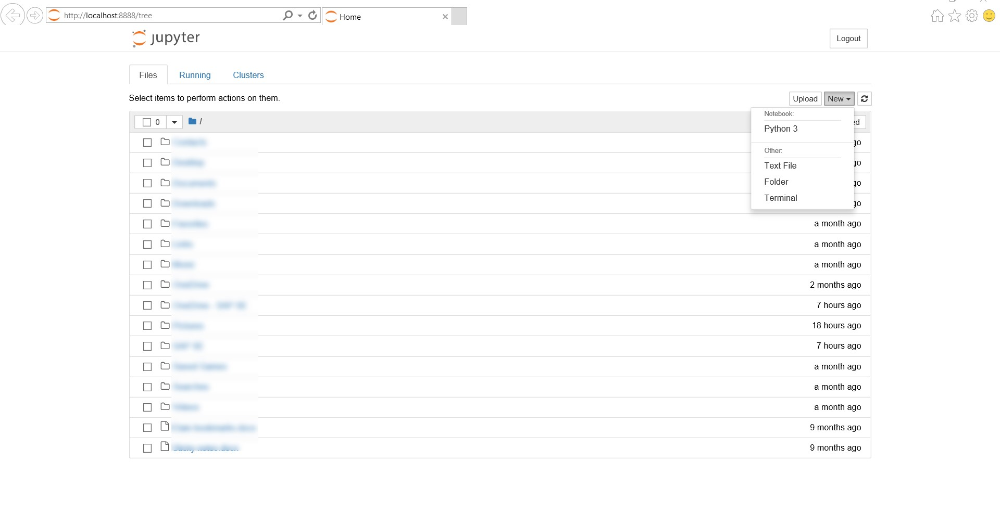

# 52465Programming-for-Data-An.-Assignments
This repository will contain my assignments for this course. This module is a 10 credit module.
This is the second semester of this course, and runs for thirteen straight weeks from September 10th to December 13th. 

## Instruction for this assignment;

This assignment concerns the numpy.random package in Python. The requirement of this assignment is to create a Jupyter notebook explaining the use of the package, including detailed explanations of at least five of the distributions provided for in the package. 

## There are four distinct tasks to be carried out in my Jupyter notebook;
1.	Explain the overall purpose of the package.
2.	Explain the use of “Simple random data” and “Permutations” functions.
3.	Explain the use and purpose of at least five “Distribution” functions.
4.	Explain the use of seeds in generating pseudorandom numbers.

# Minimum standard:
A git repository containing a README, a gitignore file & a Jupyter notebook. 
The README need only contain an explanation of what is contained in the repository and how to run the Jupyter notebook.
My notebook should contain the main body of work and list all references.

# Good submission requirements;
- Clearly organised
- Contain concise explanations of the particularities of the dataset.
- The analysis contained within the notebook will be well conceived, interesting, and well researched.
- Part of the assignment is about the use of Jupyter notebooks – I should make use of all the functionality available in the software including images, links, code & plots.

I knew I needed to bear these conditions in mind while completing this assignment to ensure I met the requirements.

When I initially read the description of what was required from this assignment I was uncertain of how to proceed. 
I focused my attention on the Moodle videos supplied by Dr. Ian McLoughlin, along with researching online to gain the knowledge I would need to be able to complete the assignment.

I knew I needed to create one single Jupyter notebook, which would include all 4 tasks.

Ian had mentioned in the video that he expected students to take the existing package (https://docs.scipy.org/doc/numpy-1.15.1/reference/routines.random.html) and provide a less robotic description of what the data is about. 

The videos I reviewed on Moodle for this assignment were focused on Jupyter and NumPy.
The Jupyter package can be used to create visual workflows to tell a data analytics story. 
NumPy can be used to generating random data. The numpy.random package can be used to generate random data in Python.

Ian mentioned in the instructions for this assignment that ‘part of the assignment is about the use of Jupyter notebooks, so students should make use of all the functionality available in the software including images, links, codes and plots.’ I decided to pay closer attention to how to utilise these functionalities when reviewing the Jupyter videos than I had when I initially watched them.

I	re-watched the *‘Starting Jupyter Video’*, which provided an introduction to getting Jupyter running on my computer. 
I accessed Jupyter via the Anaconda Navigator as shown in the below screenshot;

The below browser window opened;

 
I also found the the	*'Renaming Notebooks Video'* very helpful.

I did some research on the web for a definition of what Jupyter actually is;
'The Jupyter Notebook is an open-source web application that allows you to create and share documents that contain live code, equations, visualizations and narrative text. Uses include: data cleaning and transformation, numerical simulation, statistical modeling, data visualization, machine learning, and much more'. (Reference: http://jupyter.org/)

I re-watched the *'Cells in Jupyter'* video after reading the assignment requirements and realised that in order to complete the four tasks and explain them in my Jupyter notebook I would need to employ the use of Markdown cells – these cells allow the user to type text into the cell, but the cell will not expect Python code – it will expect text (as per Ian’s comments in the video). 

I learned from this video that the idea with Jupyter notebook is that you can combine Code cells which contain Python code and the Markdown cells which contain markdown text and outputs of the Python code so that you can tell a story – this is useful for viewers who may not be very familiar with programming but who wish to review your analysis. 

In order to utilise the Markdown Cell functionality the user must go to ‘Cell Type’ and click ‘Markdown’. 

Some useful notes from the 'Jupyter Keyboard Shortcuts Video';

- For headings = #
- For bullet points = -
- Edit mode = green
- Command mode = blue (not in edit mode) 
- Purpose of command mode = enable use of keyboard shortcuts more effectively. Example: move from cell to cell with the up and down keys.
- To move from edit to command mode: press Escape button on keyboard
- To move from command to edit = press enter

Some useful notes from the *'Code and markdown cells in jupyter Video'*;
- How to change from a code cell to a markdown cell: press ‘m’ for markdown on your keyboard.
- To convert back to code from markdown: press ‘y’
- You can type any valid python code into a code cell. Then hold down shift & enter. Output provided to jupyter and displayed under the cell.
- Markdown cells: double click on the rendered cell to edit it again.

I utilised a github guide named ‘Mastering Markdown’; https://guides.github.com/features/mastering-markdown/
- One # = top level heading.	
- To make markdown cells to look more attractive (to render the cell) hold down shift and press enter on keyboard.

I then decided to move on to the Generating random data (NumPy) videos. 
These videos concentrate on the numpy.random package for generating random data in Python. 
The numpy.random package is the subject of this assignment. 

My Jupyter Notebook *Jupyter Notebook for Module 52465.ipynb* which is accessible via this repository contains the following:
1.	Explain the overall purpose of the numpy.random package.
2.	Explain the use of “Simple random data” and “Permutations” functions.
3.	Explain the use and purpose of at least five “Distribution” functions.
4.	Explain the use of seeds in generating pseudorandom numbers.

After reading the assignment requirements I knew I would need to look back at my github repositories from last semester in which I submitted assignments for previous modules to refresh my memory on how to use github correctly. 

When reviewing my previous submissions from 7 months ago to my github repository for last semester’s module *52167 - Programming and Scripting* I was able to quickly refresh my memory and recall some of the basic but important skills I had learned in terms of submitting content to a README in github, such as how to upload an image;

I learned this from [Mastering Markdown](https://guides.github.com/features/mastering-markdown/) and have included some images in this README. 
I knew how to upload pictures to a README in GitHub from [Mastering Markdown](https://guides.github.com/features/mastering-markdown/). The below image is supplied on [Mastering Markdown](https://guides.github.com/features/mastering-markdown/) and I employed this technique to initially upload images from the web to README;

(Reference: Etain Upton’s repository which was submitted for module 52167 - Programming and Scripting https://github.com/EtainUpton/Etain-s-Project-2018---52167---Programming-and-Scripting)

I also realised that if I clicked on the README in my repository and then clicked ‘Edit this file’ I’d see exactly what I had done to create headings in bold, etc for this README;
 

I remembered that it was as simple as including a # before the sentence I wanted to make a title/heading; 

