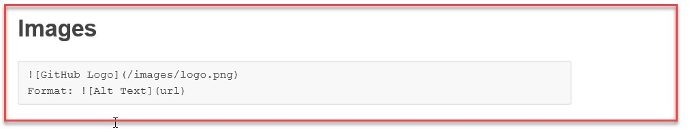
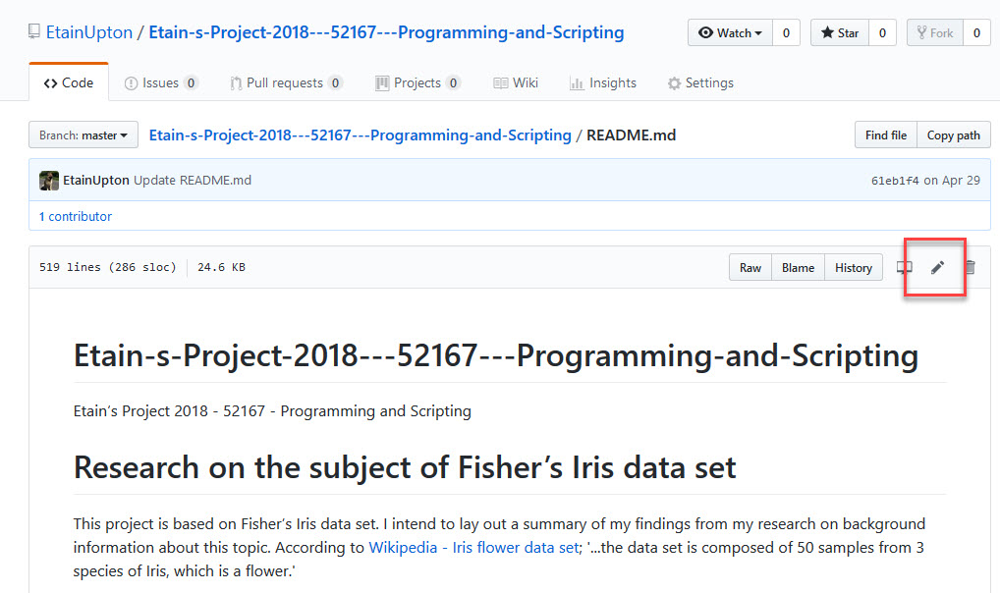
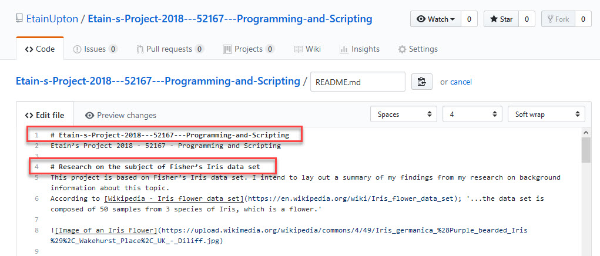

# 52465Programming-for-Data-An.-Assignments
This repository will contain my assignments for this course. This module is a 10 credit module.
This is the second semester of this course, and runs for thirteen straight weeks from September 10th to December 13th. 

# Ian’s instruction for this assignment;

This assignment concerns the numpy.random package in Python. The requirement of this assignment is to create a Jupyter notebook explaining the use of the package, including detailed explanations of at least five of the distributions provided for in the package. 

# There are four distinct tasks to be carried out in my Jupyter notebook;
1.	Explain the overall purpose of the package.
2.	Explain the use of “Simple random data” and “Permutations” functions.
3.	Explain the use and purpose of at least five “Distribution” functions.
4.	Explain the use of seeds in generating pseudorandom numbers.

# Minimum standard:
A git repository containing a README, a gitignore file & a Jupyter notebook. 
The README need only contain an explanation of what is contained in the repository and how to run the Jupyter notebook.
My notebook should contain the main body of work and list all references.

# Good submission requirements;
•	Clearly organised
•	Contain concise explanations of the particularities of the dataset.
•	The analysis contained within the notebook will be well conceived, interesting, and well researched.
•	Part of the assignment is about the use of Jupyter notebooks – I should make use of all the functionality available in the software including images, links, code & plots.

I knew I needed to bear these conditions in mind while completing this assignment to ensure I met the requirements.
After reading the assignment requirements I knew I would need to look back at my github repositories from last semester in which I submitted assignments for previous modules to refresh my memory on how to use github correctly. 

I had watched most of the videos which were uploaded to Moodle by Ian at this stage which related to Jupyter & NumPy. 

When reviewing my previous submissions from 7 months ago to my github repository for last semester’s module 52167 - Programming and Scripting I was able to quickly refresh my memory and recall some of the basic but important skills I had learned in terms of submitting content to a README in github, such as how to upload an image;

While researching READMEs I wondered how I would correctly upload an image (e.g. a chart) to GitHub. I learned this from [Mastering Markdown](https://guides.github.com/features/mastering-markdown/) and have included some images in this README. I will delve into the initial challenges I faced while trying to successfully complete this;
I knew how to upload pictures to a README in GitHub from [Mastering Markdown](https://guides.github.com/features/mastering-markdown/). The below image is supplied on [Mastering Markdown](https://guides.github.com/features/mastering-markdown/) and I employed this technique to initially upload images from the web to README;

However, I was unsure how to correctly upload screenshots from my own machine to show the work I had completed in Visual Studio Code. I remembered covering this in the ‘READMEs’ video on Moodle, so I referred back to this for guidance. I learned that you must follow the same formula as shown in the above image in terms of the exclamation point at the beginning of where you wish to insert an image, square brackets containing a description of what the image represents, and regular brackets with the name of the image from the web, however you insert the name of the image which you have saved in your GitHub repository from your own machine inside the regular brackets brackets. I initially tried to complete this with a PNG file, but when this did not work I saved the image on my desktop again as a JPG file and was able to upload it to the repository and successfully upload it to the README. I also realised through trial and error that there can be no spaces in the name of the image.

I also learned that it is possible to hyperlink [Python]( https://www.python.org/).
(Reference: Etain Upton’s repository which was submitted for module 52167 - Programming and Scripting https://github.com/EtainUpton/Etain-s-Project-2018---52167---Programming-and-Scripting)

# Name of Module: 52167 - Programming and Scripting
Subject of the assignment:
Research on the subject of Fisher’s Iris data set
Completed 7 months ago

I also realised that if I clicked on the README in my repository and then clicked ‘Edit this file’ I’d see exactly what I had done to create headings in bold, etc for this README;
 

I remembered that it was as simple as including a # before the sentence I wanted to make a title/heading; 

Italics
Referencing

When I initially read the description of what was required from this assignment I was totally clueless as to what I needed to do. Luckily Ian had mentioned in the Assignment Video on Moodle that this would be discussed in videos from week 5, so I decided to focus my attention on these videos.
I knew I needed to create one single Jupyter notebook, which would include all 4 tasks.
Ian had mentioned in the video that he expected students to take the existing package and provide a less robotic description of what the data is about. 
He advised that students should describe with plots in a Jupyter notebook the flavour of the packages on the webpage.

